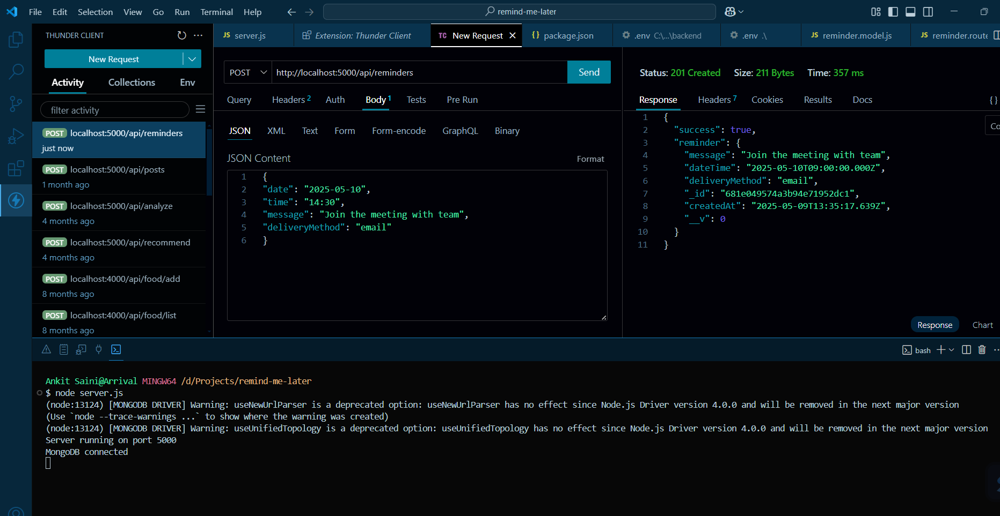

# 📅 Remind-me-later API

- View API testing results screenshots below📷


This is a simple REST API built with Node.js, Express, and MongoDB that allows users to create reminders by submitting a message, date, time, and a delivery method (currently supports SMS and Email). This backend stores the data in MongoDB but does not send messages — it only records the reminders.

---

## 🚀 Features

- Create and store reminders with:
  - Message
  - Date and time
  - Delivery method (SMS or Email)
- Modular structure with ES6+
- Scalable for future delivery methods like WhatsApp, Push Notifications, etc.

---

## 🧱 Technologies Used

- Node.js (v18+)
- Express.js
- MongoDB + Mongoose
- dotenv for environment variables
- CORS enabled

---

## 📁 Project Structure

remind-me-api/
├── models/
│ └── reminder.model.js // Mongoose schema
├── routes/
│ └── reminder.route.js // POST endpoint
├── .env // Environment variables
├── server.js // Entry point
├── package.json
└── README.md


---

## ⚙️ Installation & Setup

1. Clone the repository:

```bash
git clone https://github.com/iAnkit-1/remind-me-api.git
cd remind-me-api
```
2. Install dependencies:

```bash
npm install
```

3. Create a .env file in the root folder and add your MongoDB URI:
   ```bash
   MONGO_URI=your_mongodb_connection_string
   PORT=5000
   ```
4. Start the server:
   ```bash
   npm start
   ```

## 📮 API Endpoint

POST:  /api/reminders
Creates a new reminder in the database.   

Request Body:
```bash
{
  "date": "2025-05-10",
  "time": "15:30",
  "message": "Doctor's appointment",
  "deliveryMethod": "email"
}
```

Response:
```bash
{
  "success": true,
  "reminder": {
    "_id": "663d8ddfd524c7d42cc440cb",
    "message": "Doctor's appointment",
    "dateTime": "2025-05-10T15:30:00.000Z",
    "deliveryMethod": "email",
    "createdAt": "2025-05-09T11:23:00.000Z"
  }
}
```

## 📷 API Test Result
You can test the API using Postman or Thunder Client.

🖼️ Screenshot of API test: 


## 👨‍💻 Author
Made with ❤️ by Ankit Pushpjivi
